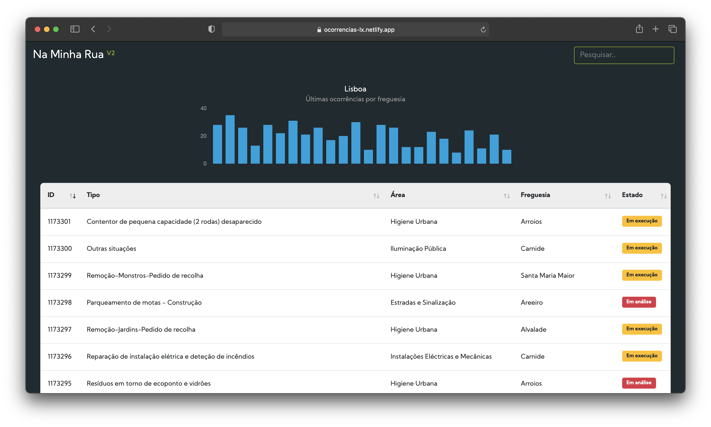

 

## Na Minha Rua V2 🇵🇹

### O que é?

Este site é um interface construído em javascript para a aplicação [Na Minha Rua](https://naminharualx.cm-lisboa.pt/), operada pela Câmara Municipal de Lisboa, que permite a qualquer cidadão registar problemas no espaço público. Uma vez que a navegação no portal não é muito amigável, a versão V2 vai buscar as últimas 1000 ocorrências à API pública e lista-as numa [data table](https://github.com/DataTables/DataTables) que carrega imediatamente, mais fácil de filtrar/reordenar/pesquisar. Cada linha é clicável, abrindo uma janela modal com mais detalhes, e um marcador sobre [mapa estático Mapbox](https://www.mapbox.com/static-maps). O topo da página mostra um gráfico de barras com  ocorrências por freguesia, construída com o [Chart.js](https://github.com/chartjs).

Graças ao plugin Netlify "fetchmyjson" (baseado no [netlify-plugin-fetch-feeds](https://github.com/philhawksworth/netlify-plugin-fetch-feeds)) e a uma Github Action, o website é reconstruído uma vez por hora, copiando os dados da API para um documento json interno, limitando assim os pedidos à API ao mínimo.

### Próximos objectivos
- Alteração do CSS para facilitar navegação em dispositivos móveis
- Atalhos para filtros dentro da tabela e/ou caixa de pesquisa
- Minimização dos pedidos à API Mapbox 

### Websites
O website está alojado no Netlify em:   
https://ocorrencias-lx.netlify.app

Está também em desenvolvimento uma versão que apenas utiliza o Mapbox GL JS:   
https://ocorrencias-lx-mapa.netlify.app

## Na Minha Rua V2 🇬🇧

### What is it?

This website is a interface built in javascript for the [Na Minha Rua](https://naminharualx.cm-lisboa.pt/) [_In My Street_] portal, which is operated by the Lisbon City Hall and enables citizen reporting of problems within public areas. Since the app's navigation is not very friendly, the V2 version fetches the last 1000 occurrences from the public API, and lists them in a fast-loading [data table](https://github.com/DataTables/DataTables), much easier to filter/sort/search. Each line is clickable, opening a modal with more details, and a marker over a [Mapbox static map](https://www.mapbox.com/static-maps). The top of the page presents a bar graph displaying occurrences by parish, built with [Chart.js](https://github.com/chartjs).

The website is hosted by Netlify at:   
https://ocorrencias-lx.netlify.app

Thanks to the Netlify plugin "fetchmyjson" (based on [netlify-plugin-fetch-feeds](https://github.com/philhawksworth/netlify-plugin-fetch-feeds)) and a Github Action, the website is rebuilt every hour, copying the API's records to an internal json document, thus limiting API queries to the very minimum.

### Upcoming goals
 - CSS changes for mobile-ready navigation
 - Shortcuts to filters within the table and/or search box
 - Limiting queries to the Mapbox API
 
### Websites

The website is hosted by Netlify at:   
https://ocorrencias-lx.netlify.app

A version using only Mapbox GL JS is also being developed at:    
https://ocorrencias-lx-mapa.netlify.app
